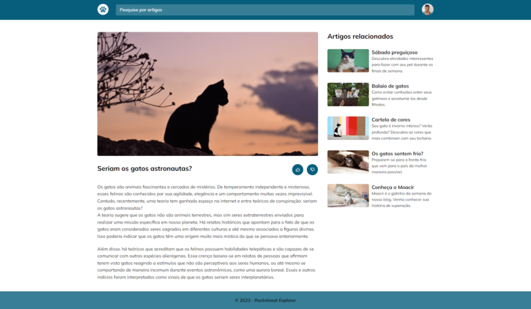
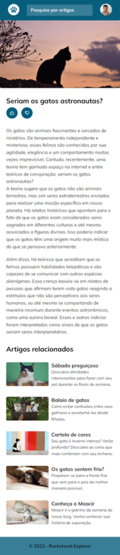

## PROJECT

This is a cats blog webpage challenge from the rocketseat explorer program

## TECH
This project was developed using the following technologies:
- HTML
- CSS

  

    <h1 align="center">web-version</h1>
    
  

  

    <h1 align="center">mobile-version</h1>
    
  

